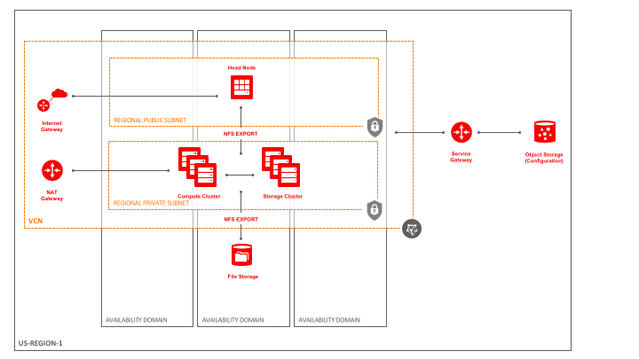

# oci-hpc-terraform-arch
High Performance Computing and storage in the cloud can be very confusing and it can be difficult to determine where to start. This repository is designed to be a first step in expoloring a cloud based HPC storage and compute architecture. There are many different configurations and deployment methods that could be used, but this repository focuses on a bare metal compute system deployed with Terraform. After deployment fully independant and functioning IaaS HPC compute cluster has been deployed based on the architecture below.

This deployment is an example of cluster provisioning using Terraform and SaltStack. Terraform is used to provision infrastructure, while Salt is a configuration and cluster management system. 

Salt configuration is stored under ./salt directory, containing pillar/ (variables) and salt/ (state) information. Read more about salt in the documentation: https://docs.saltstack.com/en/latest/

### Architecture

### SSH Key
  
SSH key is generated each time for the environment in the ./key.pem file. 

### Networking 

- Public subnet

  Headnode acts a jump host and it's placed in the public subnet. The subnet is open to SSH connections from everywhere. Other ports are closed and can be opened using custom-security-list in the OCI console/cli. 
  All connections from VCN are accepted. Host firewall service is disabled by default. 

- Private subnet
  
  All connections from VCN are accepted. Public IP's are prohibited in the subnet. Internet access is provided by NAT gateway. 

### Storage

- Block volumes

  Each node type can be configured with block volumes in the variables.tf
  Headnode will export first block volume as NFS share under /mnt/share (configured in salt/salt/nfs.sls)
  Other block volume attachments need to be configured manually after cluster provisioning. 

- GlusterFS 

  To use Gluster specify Gluster shape and node count in the variables.tf
  Filesystem will be greated as :/gfs and mounted under /mnt/gluster

- FSS
  
  File system service endpoint will be created in the private subnet and mounted on each node under /mnt/fss
